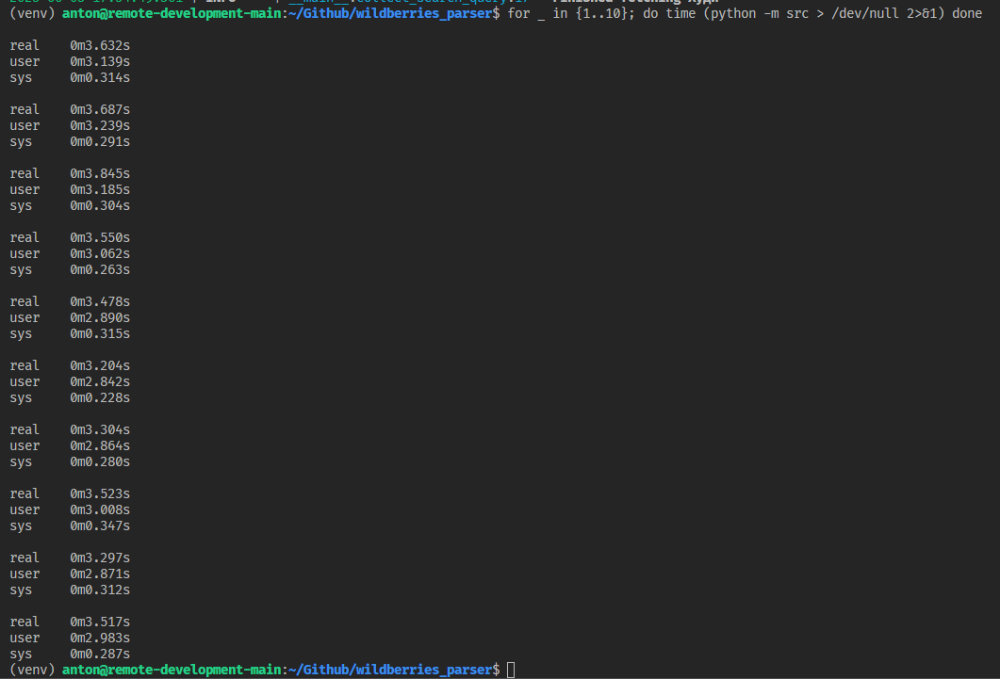

Сейчас реализован очень тестовый вариант реализации клиента апишки да и приложения как такового, документации паблик апишки не нашёл, значит рейт лимиты и ошибки придётся тестировать самостоятельно. В рамках задачи решил не тратить время.

В текущей реализации приложение очень легко масштабировать, вижу примерно следующим образом:

- Можно заскейлить в любое облако за 0 минут, брать тасочки из куеуе, и складывать результаты в базу вместо цсвшек
- Можно заскейлить в кластер с распределением по воркерам и проксированием

Парсить разные регионы судя по всему можно при помощи dest аргумента в урле, маппинг регионов в dest айдишки можно взять в публичной апишке, предположительная ручка комментом в клиенте апишки написана, если нужно имплементировать готов изучить в свободное время

В описании задачи есть просьба предложить оптимальный вариант для фетча 30 страниц по 100к запросов: \
Из текущего варианта реализации можно будет ускорять дальше, уверен если погрузиться в вопрос то можно оптимизировать текущую реализацию клиента во много раз. \
Но в целом -- kubernetes does pods 1000 brrr

Очень некачественные замеры перфа:

5 запросов по 30 страниц занимают +-3.5 секунды по результатам десяти ранов. \
Из особенностей: замеры с немецкого айпи, возможно будет лучше если поближе к серверам сесть
